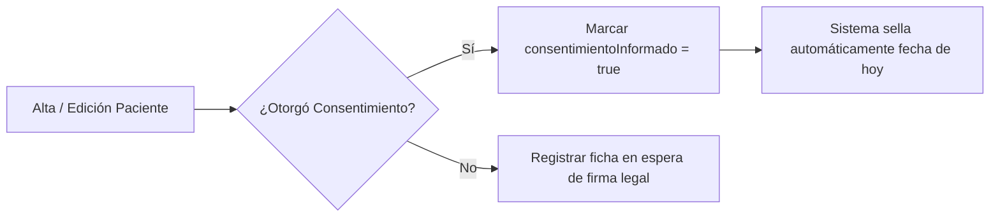

# Manual de Usuario y Guía de Operación
## PsiClínica — Sistema de Gestión Clínica y Psiquiátrica

---

## 🚀 1. Guía Rápida de Arranque (Backend + Frontend)

Este sistema funciona con una arquitectura moderna de clientes separados:
* **Backend:** API REST en Java 17 / Spring Boot 3 con seguridad JWT, JPA y cifrado AES-256-GCM (Puerto `8080`).
* **Frontend:** Single Page Application (SPA) en React 19 / Vite (Puerto `5173`).
* **Base de Datos:** MySQL 8.0+ (Puerto `3306`).

### Pasos para iniciar el Backend (Servidor API)
1. **Verificar la Base de Datos:** Asegurate de que **MySQL** esté ejecutándose (por ejemplo, desde el panel de **XAMPP** iniciando el servicio de MySQL).
2. **Abrir Terminal en la carpeta raíz:**
   ```powershell
   cd c:\Users\Usuario\OneDrive\Desktop\consultorio-medico
   ```
3. **Ejecutar el script de arranque local:**
   ```powershell
   .\run_prod_local.ps1
   ```
   *(Nota: Este script carga automáticamente las variables de entorno de tu archivo `.env` y lanza `mvnw spring-boot:run`).*
4. **Verificación de éxito:** Verás en la consola el mensaje `Tomcat started on port 8080` y `Started ConsultorioMedicoApplication`.
5. **Documentación Swagger UI:** Podés probar y explorar todos los endpoints en el navegador:
   * [http://localhost:8080/swagger-ui/index.html](http://localhost:8080/swagger-ui/index.html)

---

### Pasos para iniciar el Frontend (Interfaz Web)
1. **Abrir una nueva Terminal** y navegar a la carpeta de la interfaz web:
   ```powershell
   cd c:\Users\Usuario\OneDrive\Desktop\consultorio-medico\frontend
   ```
2. **Instalar dependencias de Node.js** *(Sólo es necesario la primera vez o cuando se actualicen paquetes)*:
   ```powershell
   npm install
   ```
3. **Iniciar el servidor de desarrollo de Vite:**
   ```powershell
   npm run dev
   ```
4. **Acceder a la Aplicación Web:** Abrí tu navegador en la URL indicada por consola (por defecto):
   * **[http://localhost:5173](http://localhost:5173)**

---

## 🔑 2. Usuarios Disponibles y Credenciales del Sistema

El sistema cuenta con dos niveles de acceso jerárquicos basados en roles (`ADMIN` y `USER`):

| Rol | Usuario por defecto | Contraseña | Nivel de Acceso |
| :--- | :--- | :--- | :--- |
| **Administrador (`ADMIN`)** | `admin` | `Admin@Consultorio2026!` *(o `123456` si fue modificada en pruebas locales)* | **Acceso Total:** Gestión de usuarios del sistema, configuración, métricas, logs de auditoría de accesos y acceso clínico completo. |
| **Profesional Médico (`USER`)** | *Creado por el Administrador* | *Asignada al crearlo* | **Acceso Clínico:** Gestión de pacientes, consultas médicas, historias psiquiátricas, consentimiento informado y exportación de historias clínicas a PDF. |

> [!NOTE]
> **¿Cómo crear usuarios normales (`USER`)?**  
> El Administrador (`admin`) puede dar de alta nuevos profesionales médicos o personal administrativo desde el módulo de usuarios o realizando una solicitud `POST /api/users` especificando `"role": "USER"`.

---

## 🩺 3. Manual Operativo para el Usuario Normal (Rol `USER` - Profesional Médico)

El usuario profesional tiene acceso al corazón clínico de la aplicación, diseñado para simplificar la atención del paciente cumpliendo con las leyes de salud de la República Argentina.

### 3.1 Gestión de Pacientes y Consentimiento Informado (Ley 25.326)
* **Alta y Edición de Pacientes:** Permite registrar los datos personales, de contacto, demográficos y antecedentes familiares (`datosPadres`, `datosHijos`, `datosHermanos`).
* **Consentimiento Informado:**
  * Al dar de alta o actualizar la ficha de un paciente, el profesional dispone del campo **"Consentimiento Informado Firmado"** (`consentimientoInformado: true`).
  * Al activarlo, el sistema **registra de manera indeleble la fecha del consentimiento** (`fechaConsentimiento`), cumpliendo con el requisito legal de tratamiento de datos personales de salud (Ley 25.326).



### 3.2 Seguridad Invisible: Cifrado en Reposo de Antecedentes Familiares y Médicos
* **Protección legal automática:** Como profesional, no necesitás realizar ningún paso extra para encriptar los datos.
* Al escribir información confidencial (como antecedentes familiares de salud mental o notas íntimas de la consulta), el sistema aplica un algoritmo de grado militar (**AES-256-GCM**) antes de guardarlo en MySQL (`ENC:...`).
* Si un tercero o administrador de sistemas accede directamente a la base de datos, **no podrá leer la historia clínica sin la clave criptográfica del consultorio**.

### 3.3 Registro de Consultas y Evoluciones Clínicas
* Cada paciente dispone de su historial cronológico de visitas (`Consultas`).
* **Datos clínicos registrados:**
  * Motivo de consulta y enfermedad actual.
  * Diagnóstico y Plan de Tratamiento.
  * Notas de evolución clínica (cifradas en reposo).
  * **Métricas psiquiátricas (escala 1 a 10):** Estado de ánimo, calidad de sueño, alimentación, sociabilidad y funcionalidad (laboral, social y familiar).

### 3.4 Exportación Legal a PDF (Ley 26.529 — Derechos del Paciente)
* La **Ley de Derechos del Paciente (Ley 26.529)** obliga al centro médico a entregar una copia íntegra y legible de la historia clínica cuando el paciente o autoridad competente lo solicite, en un plazo no mayor a 48 horas.
* **Cómo usarlo:**
  1. Ingresar a la ficha del paciente.
  2. Hacer clic en el botón de **"Exportar Historia Clínica (PDF)"** (o llamar a `GET /api/pacientes/{id}/export-pdf`).
  3. El sistema generará automáticamente un archivo PDF oficial, membretado, foliado y con todo el historial de consultas del paciente en orden cronológico formal.

---

## 🛡️ 4. Manual Operativo para el Administrador (Rol `ADMIN`)

El Administrador tiene el control de la seguridad, auditoría y cuentas del consultorio médico.

### 4.1 Gestión de Usuarios del Sistema (`/api/users`)
* El Administrador es el único facultado para **crear nuevas cuentas de usuario** para médicos, psiquiatras o personal de recepción.
* Puede listar todos los usuarios registrados y verificar sus roles activos.
* **Buenas Prácticas:** Asignar el rol `USER` a los médicos tratantes y reservar el rol `ADMIN` exclusivamente para la administración general del consultorio.

### 4.2 Módulo de Auditoría y No Repudio de Lectura (`Access Logs`)
* **¿Qué es?** Para garantizar que nadie acceda a la ficha de un paciente sin justificación clínica, el sistema incluye un servicio de auditoría transparente (`AccessLogService`).
* **Qué se registra:**
  * **Quién:** Usuario que realizó la acción.
  * **Qué paciente:** ID y nombre del paciente consultado.
  * **Acción:** `VER_FICHA`, `VER_HISTORIA_PSIQUIATRICA`, `VER_CONSULTA`.
  * **Cuándo y desde dónde:** Fecha, hora exacta y dirección IP de origen.
* **Cómo consultarlo:** El Administrador puede supervisar estos accesos para detectar visualizaciones indebidas o garantizar el secreto médico ante inspecciones.

### 4.3 Recomendaciones de Seguridad para Producción
* **Cambiar la contraseña del administrador:** En el archivo `.env`, modificar `ADMIN_PASSWORD` por una contraseña segura antes de exponer el servidor.
* **Clave de Encriptación (`ENCRYPTION_KEY`):** Asegurarse de que el archivo `.env` mantenga una clave secreta fuerte y respaldada. Si esta clave se pierde, los datos encriptados en la base de datos no podrán ser desencriptados.
* **Respaldos (Backups):** Se recomienda programar un respaldo regular de MySQL junto con una copia de seguridad del archivo `.env`.

---

## 📋 5. Resumen de Endpoints Principales (Referencia Rápida)

```markdown
# Autenticación y Tokens
POST   /api/auth/login        -> Iniciar sesión (Devuelve cookie HttpOnly y token en JSON)
POST   /api/auth/logout       -> Cerrar sesión y revocar token

# Pacientes (Requiere Rol USER o ADMIN)
GET    /api/pacientes         -> Listar pacientes activos
POST   /api/pacientes         -> Crear nuevo paciente (y registrar consentimiento)
GET    /api/pacientes/{id}    -> Ver ficha clínica (Desencriptado automático + Audit Log)
PUT    /api/pacientes/{id}    -> Actualizar datos / firmar consentimiento informado
GET    /api/pacientes/{id}/export-pdf -> Descargar Historia Clínica Legal en PDF

# Gestión de Usuarios y Auditoría (Exclusivo Rol ADMIN)
GET    /api/users             -> Listar todos los usuarios del sistema
POST   /api/users             -> Dar de alta un nuevo médico o administrador
GET    /api/access-logs       -> Consultar historial de auditoría de lecturas
```
